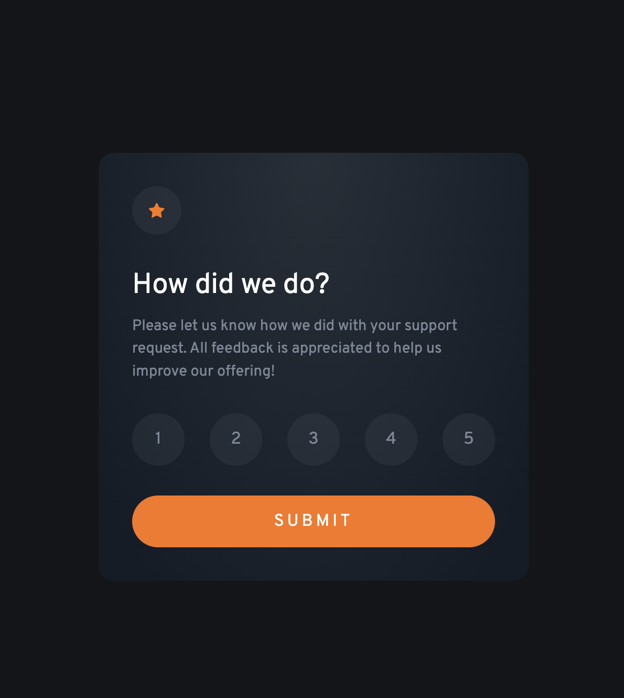
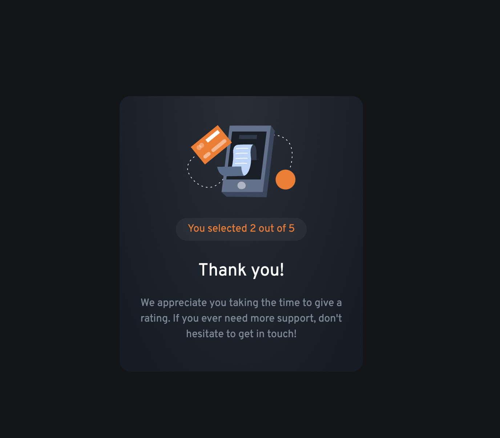

# Frontend Mentor - Interactive rating component solution

This is a solution to the [Interactive rating component challenge on Frontend Mentor](https://www.frontendmentor.io/challenges/interactive-rating-component-koxpeBUmI). Frontend Mentor challenges help you improve your coding skills by building realistic projects.

## Table of contents

- [Overview](#overview)
  - [The challenge](#the-challenge)
  - [Screenshot](#screenshot)
  - [Links](#links)
- [My process](#my-process)
  - [Built with](#built-with)
  - [What I learned](#what-i-learned)
  - [Useful resources](#useful-resources)
- [Author](#author)

## Overview

### The challenge

Users should be able to:

- View the optimal layout for the app depending on their device's screen size
- See hover states for all interactive elements on the page
- Select and submit a number rating
- See the "Thank you" card state after submitting a rating

### Screenshot

### Links

- Solution URL: [Add solution URL here](https://github.com/CristobalAlvarezGutierrez/interactive-rating-component)
- Live Site URL: [Add live site URL here](https://interactive-rating-component-lemon.vercel.app/)

## My process

### Built with

- CSS custom properties
- Flexbox
- [React](https://reactjs.org/) - JS library

### What I learned

In this challenge I had the oportunity to put in practice what I've learned from the courses of Kevin Powell "Conquering Responsive Layouts" and "Build a space travel website".

### Useful resources

- [Example resource 1](https://scrimba.com/learn/spacetravel/using-our-general-utility-classes-co0ab4674a5afa4bea6e830cc) - Course of Kevin Poweel "Build a space travel website"
- [Example resource 1](https://courses.kevinpowell.co/view/courses/conquering-responsive-layouts/233004-day-1-using-percentages-avoiding-heights/678543-percentages-vs-fixed-widths) - Course of Kevin Poweel "Conquering Responsive Layouts"

## Author

- Frontend Mentor - [@CristobalAlvarezGutierrez](https://www.frontendmentor.io/profile/CristobalAlvarezGutierrez)